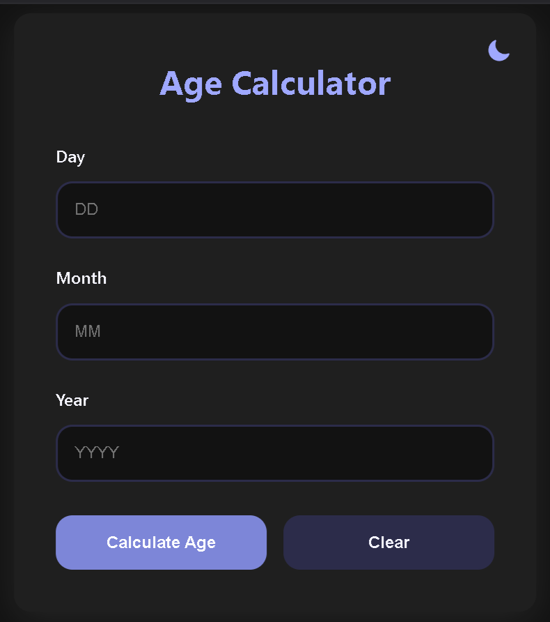

# 🧮 Age Calculator

An interactive and responsive web app that calculates a user's age based on their input birth date. Includes light/dark mode toggle, clear error messages, and a polished UI using HTML, CSS, and JavaScript.

<br>

## 📌 Table of Contents

* [✨ Features](#-features)
* [📸 Preview](#-preview)
* [📁 Project Structure](#-project-structure)
* [⚙️ Technologies Used](#️-technologies-used)
* [🚀 Getting Started](#-getting-started)
* [🧪 Usage](#-usage)
* [📈 Improvements](#-improvements)
* [🤝 Contributing](#-contributing)
* [📄 License](#-license)
  
<br>

## ✨ Features

✅ Age calculation in **years**, **months**, and **days** <br>
✅ Light and Dark theme toggle 🌙☀️ <br>
✅ Clean, responsive design across devices <br>
✅ Form validation with dynamic error feedback <br>
✅ Reset/Clear button for quick re-entry <br>
✅ Minimal and modern UI <br>
✅ Well-commented and easy-to-understand source code 

<br>

## 📸 Preview

| Light Mode                                              | Dark Mode                                             |
| ------------------------------------------------------- | ----------------------------------------------------- |
|  |  |

<br>

## 📁 Project Structure

```bash
Task_1/
│
├── assets/                  # Asset Folder
│   └── images/              # Contains Image Previews/Screenshots
│       ├── Picture_1.png    # Light Mode Preview
│       └── Picture_2.png    # Dark Mode Preview
│
├── index.html               # Main HTML File
├── LICENSE                  # MIT License
├── README.md                # Project Documentation
├── script.js                # JavaScript Logic (Age Calculation, Theme Toggle)
└── style.css                # CSS Styling (Responsive Design, Themes)
```

<br>

## ⚙️ Technologies Used

| Tech           | Description                     |
| -------------- | ------------------------------- |
| HTML5          | Markup for structure            |
| CSS3           | Styling, responsive layout      |
| JavaScript ES6 | Logic, DOM manipulation, events |

<br>

## 🚀 Getting Started

Follow these steps to run locally:

1. **Clone the repository**

   ```bash
   git clone https://github.com/FrostByte-49/CodeAlpha_.git
   cd CodeAlpha_/Task_1
   ```

2. **Open `index.html` in your browser**
   *or use Live Server in VS Code*

<br>

## 🧪 Usage

1. Enter your birth **day**, **month**, and **year**.
2. Click **"Calculate Age"**.
3. Your age will appear below in a clear format.
4. Use the **"Clear"** button to reset the form.
5. Toggle between **Dark/Light themes** using the sun/moon icon 🌗

<br>

## 📈 Improvements

Here are a few enhancements that can be considered:

* [ ] Add support for time of birth
* [ ] Validate for leap years and edge cases (e.g., Feb 29)
* [ ] Save last input using localStorage
* [ ] Deploy with a custom domain
* [ ] Add animations to form transitions
* [ ] PWA support for offline use

<br>

## 🤝 Contributing

Contributions, issues, and suggestions are welcome!
Feel free to open a pull request if you have any improvements or ideas.

```bash
# Fork the repository
# Create a new branch
git checkout -b feature/your-feature-name

# Make changes and commit
git commit -m "Added new feature"

# Push and create a pull request
git push origin feature/your-feature-name
```

<br>

## 📄 License

This project is licensed under the [MIT License](LICENSE). <br>
**© 2025 Pranav Khalate**

<br>


