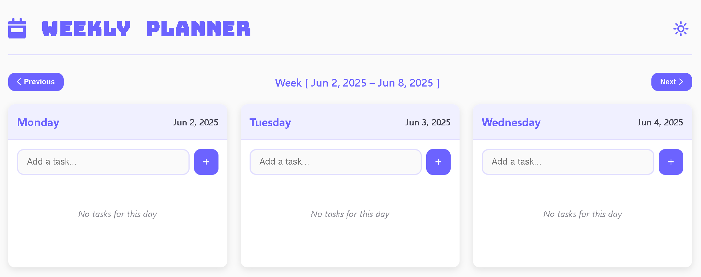
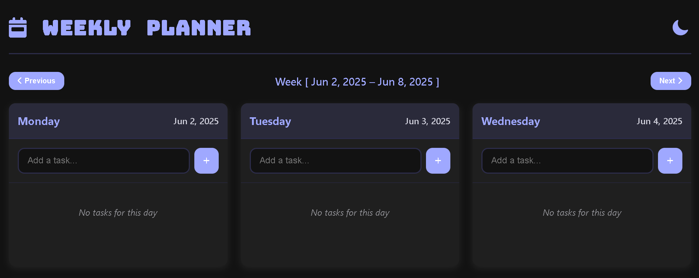

# 🗓️ Weekly Planner

A sleek, responsive **weekly planner web app** to organize your tasks day-by-day with time slots, task descriptions, and intuitive controls. Includes **light/dark mode**, modal-based task input, week navigation, and a fully interactive UI — built using **HTML**, **CSS**, and **JavaScript**.

<br>

## 📚 Table of Contents

* [✨ Features](#-features)
* [📸 Preview](#-preview)
* [📁 Project Structure](#-project-structure)
* [⚙️ Technologies Used](#-technologies-used)
* [🚀 Getting Started](#-getting-started)
* [🧪 Usage Guide](#-usage-guide)
* [🌈 Customization Ideas](#-customization-ideas)
* [🛠️ Future Improvements](#-future-improvements)
* [🤝 Contributing](#-contributing)
* [📄 License](#-license)
* [📄 Credits](#-credits)

<br>

## ✨ Features

✅ Weekly view with dynamic **date range** <br>
✅ Add, view, and organize **tasks with descriptions and time** <br>
✅ Built-in **modal form** for clean user input <br>
✅ Responsive layout for mobile, tablet, and desktop <br>
✅ **Light/Dark mode toggle** ☀️🌙 <br>
✅ FontAwesome icons & Google Fonts integration <br>
✅ Minimal, elegant design with **clean code structure**

<br>

## 📸 Preview

| Light Mode                                     | Dark Mode                                    |
| ---------------------------------------------- | -------------------------------------------- |
|  |  |

<br>

## 📁 Project Structure

```bash
Task_2/
│
├── assets/                  # All Static Files
│   ├── icons/               # Favicon/Icon Files
│   │   └── Picture_1.ico
│   └── images/              # Contains Image Previews/Screenshots
│       ├── Picture_1.png    # Light Mode Preview
│       └── Picture_2.png    # Dark Mode Preview
│
├── index.html               # Main HTML File
├── LICENSE                  # MIT License
├── README.md                # Project Documentation
├── script.js                # Core JavaScript Functionality
└── style.css                # Styling and Layout (Light/Dark)
```

<br>

## ⚙️ Technologies Used

| Tech             | Description                          |
| ---------------- | ------------------------------------ |
| **HTML5**        | Markup language for structure        |
| **CSS3**         | Styling, layout, and theme switching |
| **JavaScript**   | Dynamic behavior and task logic      |
| **FontAwesome**  | Icons for better UX                  |
| **Google Fonts** | Stylish and unique typography        |

<br>

## 🚀 Getting Started

To run the project locally:

1. **Clone the repository**

```bash
git clone https://github.com/yourusername/Task_2.git
cd Task_2
```

2. **Open in Browser**

Open `index.html` in your browser or use **Live Server** via VS Code for real-time preview.

<br>

## 🧪 Usage Guide

1. 🔄 Use **Previous/Next buttons** to navigate between weeks.
2. ➕ Click on any day slot to **add a new task**.
3. ⏰ Input time using **24-hour format** (e.g., 14:30).
4. 📋 Add a task title and optional description.
5. 🎨 Toggle **Light/Dark mode** with the moon/sun button.
6. 🗑️ Cancel or save tasks easily using the modal action buttons.

<br>

## 🌈 Customization Ideas

Want to make it your own?

* 🎨 Change fonts or color themes in `style.css`
* ⏱️ Add task reminders with `setTimeout`/`setInterval`
* 📱 Enhance mobile experience with drag-to-scroll
* 💾 Save tasks using **localStorage** or IndexedDB

<br>

## 🛠️ Future Improvements

* [ ] LocalStorage support to persist tasks between sessions
* [ ] Drag and drop task rearrangement
* [ ] Week selector with date picker
* [ ] Custom labels and categories
* [ ] PWA version for installable planner

<br>

## 🤝 Contributing

Contributions, suggestions, and PRs are welcome!

```bash
# Fork the repository
# Create a new feature branch
git checkout -b feature/your-feature

# Commit and push your changes
git commit -m "Added your feature"
git push origin feature/your-feature

# Open a pull request!
```

<br>

## 📄 License

This project is licensed under the [MIT License](LICENSE). <br>
<b>© 2025 Pranav Khalate</b>

<br>

## 🙌 Credits

* Icons by [Font Awesome](https://fontawesome.com/)
* Fonts by [Google Fonts](https://fonts.google.com/)


